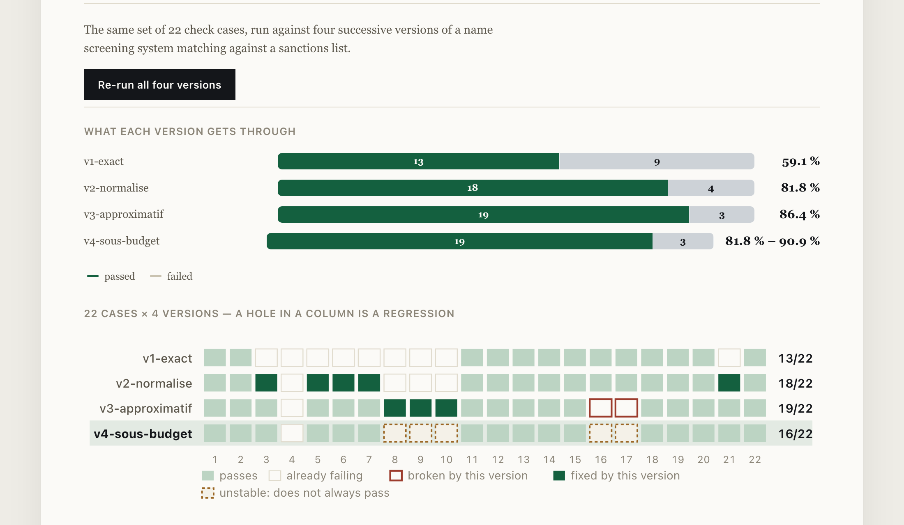

# A bench that tells you what changed, not what you scored

Most evaluation harnesses hand you a number. A number can't tell you that your pass rate
went up **while cases that used to work stopped working**.

<!-- figures:finding -->
**The finding.** Between two versions of a sanctions screener, the pass rate went **up** — 81.8 % to 86.4 % — while **2 named cases** that had been validated stopped working. On 22 cases the rate difference is inside the noise; the broken cases are not. One of those numbers is an estimate and the other is a fact, and a dashboard renders them identically.
<!-- /figures:finding -->

**[Try it in your browser →](https://arslanesempai-ui.github.io/regression-bench/)** — run the four versions yourself, then compare any two. The runs are yours and die with the tab.



```bash
npm start          # the comparison screen, on localhost:4600
npm run run-all    # run every version
npm run compare -- v2-normalise v3-approximatif
npm run stability  # the same system, several times over
npm test           # types, README figures, and 21 tests
```

Everything runs locally. No API key, nothing leaves the machine, and anyone who clones this
reproduces the numbers below.

---

## The demonstration

The system under test is a **sanctions name screening** — match a customer's name against
a watchlist. Four successive versions, each one a change any engineer would defend:

<!-- figures:versions -->
| Version | What changed | Pass rate | 95 % interval |
|---|---|---|---|
| `v1-exact` | literal string comparison | 59.1 % | [39–77] |
| `v2-normalise` | case, accents, punctuation, word order | 81.8 % | [61–93] |
| `v3-approximatif` | edit distance, for typos and transliterations | 86.4 % | [67–95] |
| `v4-sous-budget` | v3 with a time budget, falling back to exact | **varies between runs** | — |
<!-- /figures:versions -->

Read the rate column and v3 is the winner. Now ask the bench what actually happened
between v2 and v3:


<!-- figures:verdict -->
```
✗ 2 regression(s) — v2-normalise -> v3-approximatif
    court-01: expected null, got "Li Wei"
    court-02: expected null, got "Li Wei"
  (3 gain(s) elsewhere — the rate moves 81.8 % -> 86.4 %,
   which does not buy back cases that had been validated once.)
  the set cannot distinguish these versions by rate — judge the broken cases instead (5 discordant, p = 1.000)
```

Every rate on this page carries its interval because 22 cases put roughly
±14 points around any of them. 81.8 % [61–93], n=22 against 86.4 % [67–95], n=22 is not a difference this set can establish.
<!-- /figures:verdict -->

The two broken cases are not noise. They are two named inputs where a system that once
told two people apart no longer does. That asymmetry — a rate you cannot trust beside
facts you can — is the entire reason this tool reports movements rather than scores.

Fuzzy matching bought three typo cases and paid with **two distinct people now
indistinguishable**. On a short name, one character of tolerance is one character too
many: *Li Wen* is not *Li Wei*. The average went up. The system got worse at the thing it
exists to do.

That's not a contrived example. It's the ordinary arc of every screening project, and the
reason teams eventually stop being able to say whether they're making progress.

### What a regression actually costs

Nothing about running a bench is a legal requirement, and for a while this repository
cited nothing at all as a result. That was looking in the wrong place: the requirement is
on the system under test.

<!-- figures:stakes -->
| Citation | Requires | Figure | Retrieved |
|---|---|---|---|
| [31 CFR 501.603(b)(1)](https://www.law.cornell.edu/cfr/text/31/501.603) | Property blocked under a sanctions programme is reported to OFAC within ten business days of being blocked. | 10 business days | 2026-08-17 |
<!-- /figures:stakes -->

A screener that stops matching a name does not lower a score. It fails to block property
that should have been blocked, so the ten-day clock never starts — and nobody finds out
from a dashboard, because the pass rate went **up**. That is the exact failure this bench
is built to make visible, and it is why "two named cases stopped working" outranks "the
average improved".

---

## What it does

**Records runs, not scores.** A run holds the outcome of every case, one by one. A score
can't be compared; a run can. That's the whole difference between "we're at 80 %" and
"these seven cases stopped working".

**Refuses to grade on the average.** Any regression makes the change suspect, whatever the
rate did. A human can override that — but knowingly. `npm run compare` exits non-zero on
a regression, so continuous integration can block on it. A report nobody opens is not a
control.

**Detects flakiness before it poisons everything.** `v4-sous-budget` is the version nobody
thinks of as a behaviour change: fuzzy search is expensive, so it gets a time budget and
falls back to exact matching when the budget runs out. It ships as an *optimisation*.

Running the same cases eight times:

```
v4-sous-budget     4 unstable case(s)
    faute-01 : 7/8 — outputs seen: null, "Amina Haddad"
    faute-02 : 7/8 — outputs seen: null, "Olga Petrova"
    court-02 : 1/8 — outputs seen: "Li Wei", null
```

Under load, the same customer is screened differently. Every later comparison would report
regressions and gains that have nothing to do with the code, and the team would learn to
ignore the bench. **Stability is the measurement to take first**, before comparing
anything — and almost nobody takes it.

**Flags silent output changes.** Same verdict, different output. Usually harmless,
occasionally the sign that a case is passing for the wrong reason and won't pass for much
longer.

**Notices when the case set moved.** Comparing runs over different sets is a partial
comparison, and the screen says so instead of quietly averaging over whatever overlaps.

---

## The case set is the real asset

Twenty-two cases, and **every one of them carries a written reason for existing**, in both
languages. It's the most useful rule in the project: a case nobody can justify gets
deleted the day it becomes inconvenient — usually by the person who just introduced the
bug it was catching.

Seven of the twenty-two are **negative** cases, names that must *not* match. A set made
only of expected hits rewards a system that says yes to everything, and that system will
score beautifully.

One case, `accent-01`, fails in all four versions. It's left in deliberately: a bench that
only contains problems already solved tells you nothing about the ones ahead.

---

## Where every number comes from

<!-- figures:provenance -->
**1 retrieved**, **5 measured**, **5 chosen**. What each kind means, and what you are entitled to ask of it:

- **retrieved** — a public source says this, on the date recorded, in words linked from the page. *follow the link.*
- **measured** — running the code in this repository produces it. *run it yourself — the draws are seeded.*
- **chosen** — my judgement and nothing else. *check whether the sweep says it decides anything.*

| Kind | Name | What it is | Note |
|---|---|---|---|
| retrieved | `31 CFR 501.603(b)(1)` | Property blocked under a sanctions programme is reported to OFAC within ten business days of being blocked. | retrieved 2026-08-17 |
| measured | `regressions` | named cases that worked in one version and stopped in the next | a fact about the runs, not an estimate from them — it does not need an interval |
| measured | `gains` | cases that started working | reported beside the regressions, never netted against them |
| measured | `passRate` | share of cases a version gets right | always with its 95 % interval: 22 cases put roughly ±14 points around any of them |
| measured | `paired verdict` | whether the case set can distinguish two versions at all | exact binomial on the discordant pairs; usually the answer is no, and it says so |
| measured | `flakiness` | cases whose result changes between runs of the same version | determinism is declared per version, because five agreeing rounds can agree by luck |
| chosen | `CASES` | the 22 screening cases, and the expected answer for each | hand-written to cover transliteration, word order, diacritics and short names |
| chosen | `WATCHLIST` | the 8 names screened against | invented; a real list is hundreds of thousands of entries and cannot be published |
| chosen | `TOLERANCE` | edit distance allowed, as a fraction of name length | 15 % — the value that makes v3 buy typos and pay with two distinct people |
| chosen | `BUDGET_MS` | the 0.04 ms per-name budget v4 falls back under | chosen small enough that the fallback fires sometimes and not always — which is the point of v4 |
| chosen | `VERSIONS` | the 4 versions of the screener under test | each is a change any engineer would defend, which is why the arc is worth showing |
<!-- /figures:provenance -->

This is the repository whose central claim survives its own inventory intact, and it is
worth being precise about why.

The finding is not a rate. It is that **two named cases stopped working while the average
went up**, and that is a fact about the runs rather than an estimate from them. It does not
weaken when you learn the case set is 22 hand-written names: "these two regressed" is true
of any 22 cases you care to pick.

The rates are the opposite, and the bench says so on its own page — 81.8 % against 86.4 %
on 22 cases is ±14 points of interval, which is not a difference this set can establish.

Facts you can trust beside a rate you cannot. That asymmetry is the entire argument for
reporting movements instead of scores, and the table above is what makes it checkable
rather than asserted.

---

## How it's built

```
src/
  bench.ts       the harness: cases, runs, persistence
  diff.ts        run comparison, the verdict, the regression rule
  interval.ts    Wilson intervals, and whether two versions are separable at all
  stability.ts   the same system N times over, flakiness detection
  screening.ts   the system under test — four versions of name screening
  cases.ts       the 22 check cases, each with its reason for existing
  server.ts + ui.html    one screen, French or English
```

Node 26 with native TypeScript, `node:test`, no build step, no dependencies.

The harness knows nothing about screening — a system under test is any function
`(input) => output`. A bench that knows its subject only ever serves that subject.

Two details worth the trouble:

**An exception fails the case, never the run.** A bench that stops at the first crash tells
you nothing about the cases after it, and that's often where the information is.

**Duration is reported in milliseconds and percent, or not at all.** The first version
announced "+1416 %" on a two-millisecond difference — a percentage over a tiny base is
noise dressed as signal, which is precisely what this project exists to complain about.

The watchlist and every name in it are fictional.

---

## What it doesn't do

- **No LLM adapters shipped.** The harness takes any function; wiring a model to it is a
  few lines, but nothing here pretends to have measured one.
- **Small samples, and it says so.** Twenty-two cases put a ±14 point interval on any
  rate quoted here. The bench reports that interval rather than hiding it, and refuses to
  call a rate difference an improvement when the case set cannot support the claim. What
  it does *not* do is tell you how many cases you would need — that depends on the effect
  you care about, and inventing a number would be the same failing again.
- **No cost tracking.** Duration is recorded; tokens and money are not.

---

Part of a set of three: [document search that refuses when it doesn't
know](https://github.com/ArslaneSempai-ui/compliance-document-search), [an onboarding
agent that escalates when it isn't
confident](https://github.com/ArslaneSempai-ui/kyc-triage-agent), and this — the bench
that says whether either of them still works.

---

## What this does not let you conclude

**Not "v2 is better than v3."** On 22 cases, 81.8 % against 86.4 % is inside the noise and
the page says so. What is *not* inside the noise is that two named cases which had been
validated stopped working. Those are different kinds of statement, and the whole argument
of this repository is that a dashboard renders them identically.

**Not "fuzzy matching is a mistake."** It bought three typo cases. It paid with two
distinct people becoming indistinguishable. Whether that trade is worth making is a
compliance decision, not a technical one — the bench's job is to make sure somebody makes
it deliberately rather than by watching an average.

**Not "22 cases is enough."** It is enough to catch a named regression, which is all this
tool claims. It is nowhere near enough to rank two versions by rate, and the interval on
every rate on the page exists to say so out loud.

**Not "a stable version is a correct one."** Stability measures whether a system gives the
same answer twice. `v1-exact` is perfectly stable and wrong about most things.

---

## What I would do differently

**Write the flakiness measurement first.** I built the diff, then discovered the fourth
version's rate moved between runs, then found my own stability sampler could agree by luck
over five rounds. Determinism is a property you declare about a system, not one you
sample — and knowing that up front would have saved two corrections.

**Report counts before rates, everywhere, from the start.** Every rate on this page
eventually grew an interval, and several were withdrawn. Starting from "2 cases broke"
rather than "the rate moved 4.6 points" would have been right the first time.

**Test the screen, not just the engine.** The stability panel read three fields that do not
exist on the type it renders. It threw on every measurement in French and printed
"undefined" in English, and no test noticed because no test opens the page.

---

## What a reviewer can check without running anything

| Claim | Where it is checked |
|---|---|
| Every figure on this page | Generated from recorded runs; `npm test` fails if the page drifts |
| Every rate | Carries its 95 % interval; a non-deterministic version publishes no rate at all |
| Every case | Carries a written reason, in both languages, enforced by a test |
| Negative cases | At least 30 % of the set, enforced by a test, so nothing rewards saying yes |
| The regulation behind it | `31 CFR 501.603(b)(1)`, linked and quoted, guarded by a test |
| The runs | Named by version, not timestamped — the comparison is reproducible |

---

**Arslane Chaouche Ramdane** — six years in AML/KYC and financial crime operations,
moving into AI transformation work.
